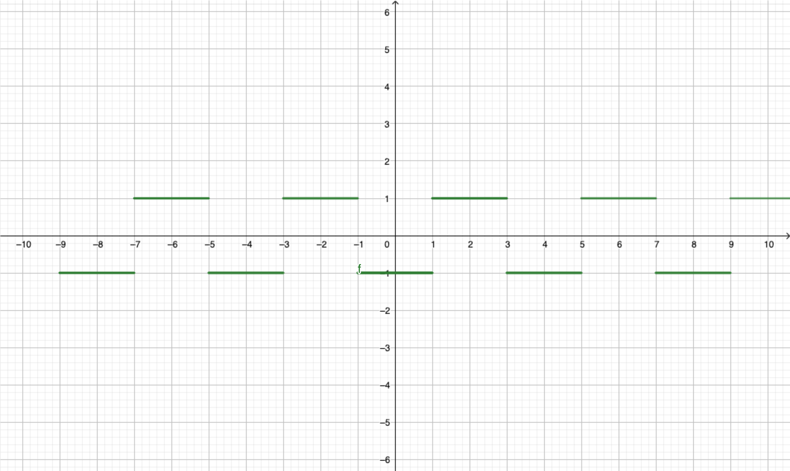

```{r setup, include=FALSE}
options(htmltools.dir.version = FALSE)
knitr::opts_chunk$set(
  fig.show =('asis'),
  dev='png',
	message = FALSE,
	warning = FALSE,
	cache = FALSE,
	hiline = TRUE,
	out.width = "90%"
)
```

## La función Coseno:

La función $f(x)=\cos(x)$ es una función **par**, con eje de simetría el eje $y,$ es decir, $$\cos(-x)=\cos(x)$$ lo cual implica que $$\int_{-\pi}^{\pi}\cos(t)dt =0.$$


## La función Seno:

La función $f(x)=\cos(x)$ es una función **impar**, con simetría en el origen, es decir, $$\sin(-x)=-\sin(x)$$ lo cual implica que $$\int_{-\pi}^{\pi}\sin(t)dt =0.$$


## Multiplos de $\pi$ para el Seno y el Coseno

-   $\sin(n\pi)=0$ para cada $n$ entero.
-   $\sin\left(\frac{(2n-1)\pi}{2}\right)=(-1)^{n+1}$ para cualquier entero $n.$
-   $\cos(n\pi)=(-1)^n$ para cualquier entero $n.$
-   $\cos\left(\frac{2(n-1)\pi}{2}\right)=0$ para todo entero $n.$

# Funciones Periódicas

**Definición:** Una función $f(t)$ se dice que es periódica de *período* $p>0$ si se cumple que $$f(t+p)=f(t).$$

*Nota:* El período es el valor mínimo para que $f$ obtenga dos valores repetidos.

**Ejemplo:** Las funciones $\sin(\cdot)$ y $\cos(\cdot)$ son períodicas de periódo $2\pi.$

**Ejemplo:** consideremos la función $f(t)=tt$ para $-1\leq t <1$ y $f(t)=f(t+1).$ De la definición obtenemos que $f$ es una función periódica. Esta función se conoce como **saw-tooth** waveform.

```{r, echo=FALSE, out.width="50%", fig.cap="Una función saw-tooth."}
knitr::include_graphics("sweattooth.png")
```

**Ejemplo:** consideremos la función $f(t)=-3$ para $-1\leq t <1$, $f(t)=3$ para $1\leq t <3$ y $f(t)=f(t+4).$ De la definición obtenemos que $f$ es una función periódica. Esta función se conoce como **square wave**.

```{r, echo=FALSE, out.width="50%", fig.cap="A nice image."}

```

# Series Infinitas

**Definición:** una **serie infinita** es una suma "infinita" de números reales, es decir, $$a_1+a_2+a_3+\cdots+a_n+\cdots,$$ y denotaremos por $$\sum_{i=1}^\infty a_n$$ al resultado de esta suma cuando sea un número real.

**Definición:** dada una serie $\sum a_n$ decimos que la **suma parcial** $s_n$ es el número real $$s_n=a_1+a_2+\cdots+a_n.$$ Si la **sucesión** de números reales $\{s_n\}_{n=1}^\infty$ converge diremos que la serie es convergente, de lo contrario que es una serie divergente.

**Ejemplo:** la serie $\sum_{n=1}^\infty 1$ es una serie divergente por que $s_n=n$ para cada $n,$ y este número crece desmesuradamente.

**Ejemplo:** la serie $\sum_{i=1}^\infty (1/2)^n$ es convergente.

**Teorema:** Si una serie $\sum a_n$ converge, entonces $\lim_{n\to \infty}a_n=0.$

Notemos que si el límite de los terminos tiende a cero, esto no implica que la serie converja.

**Teorema:** Si $\sum a_n$ y $\sum b_n$ son dos series convergentes. Entonces \* $\sum c a_n = c\sum a_n$ para $c$ una constante. \* $\sum (a_n+b_n)=\sum a_n +\sum b_n.$ \* $\sum (a_n -b_n)=\sum a_n -\sum b_n.$

## Series de Funciones

**Ejemplo:** Consideremos las siguientes funciones $$f_n(x)=\sqrt{x^2+\frac{1}{n}}$$ definida para cada natural $n.$ Estas funciones están bien definidas como funciones de $\mathbb{R}\to \mathbb{R},$ y continuas. Notemos que mientras más grande esté el natural $n,$ el número $\frac{1}{n}$ se aproxima cada vez a $0.$ Por lo tanto podemos pensar que la *sucesión de funciones* "converge" (se aproxima) a la función $$f(x)=\sqrt{x^2}=|x|.$$

**Definición:** Una serie de funciones es una suma infinita de funciones que se denota por $$\sum_{i=0}^\infty c_i f_i.$$

Estas series sirven para aproximar funciones en terminos de otras más simples. Hemos visto estas series por ejemplo en cálculo, cuando aproximabamos mediante el **Polinomio de Taylor:**

$f(x+x_0)=f(x_0)+f'(x_0)(x-x_0)+f''(x_0)\frac{(x-x_0)^2}{2}+f'''(x_0)\frac{(x-x_0)^3}{6}+\cdots=f(x_0)+\sum_{i=1}^\infty f^{(n)}\frac{(x-x_0)^n}{n!}.$
