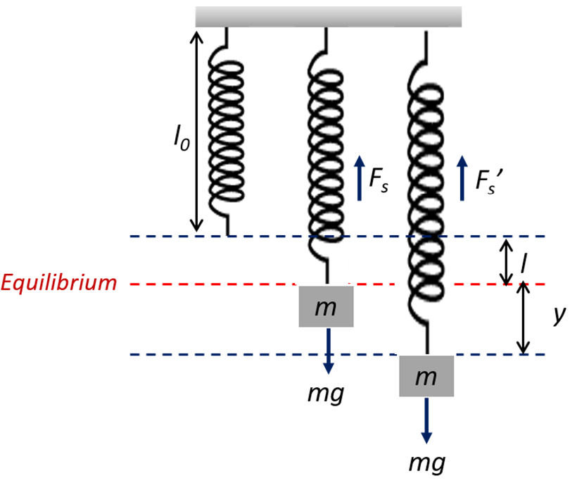

```{r setup, include=FALSE}
options(htmltools.dir.version = FALSE)
knitr::opts_chunk$set(
  fig.width=9, fig.height=3.5, fig.retina=3,
  out.width = "100%",
  cache = FALSE,
  echo = FALSE,
  message = FALSE, 
  warning = FALSE,
  hiline = TRUE
)
```

```{r xaringan-themer, include=FALSE, warning=FALSE}
library(xaringanthemer)
style_duo_accent(
  primary_color = "#000080",
  secondary_color = "#f2f3f4",
  inverse_header_color = "#00147e"
)
```

```{r xaringan-editable, echo=FALSE}
xaringanExtra::use_editable(expires = 1)
xaringanExtra::use_scribble()
```

```{r xaringan-logo, echo=FALSE}
xaringanExtra::use_logo(
  image_url = "https://github.com/alxcn/TecLogoEIC/blob/9562a53875418e749a296c85808a19c85fc4be74/IngenieriaCiencias_Horizontal_RGB.png",
  position = xaringanExtra::css_position(top = "2em", right = "2em")
)
```
# Goals

* We will use the Newton law to model a spring-mass system.
* Using the Auxiliary polynomial and Undeterminated Coefficients we will solve those models.

---
# Spring-Mass system

Suppose that you a spring that one side is attached to a platform and in the other there is a suspended object of mass $m_w.$ We whant to know the function that describe the position of the object in the time $t.$



---
# Hypothesis:

We will model this system with the following hypothesis:

1. _Conservation_ the sum of all (interacting) forces is equal to cero.
1. _Newton law's_ the force is proportional to the mass(weight) and the acceleration, i.e. $$F=m\frac{d^2x}{dt^2}.$$
1. _Hooke's law_ the force of the spring's restablishment is opposite to the direction of the stretch and proportional to this quantity, i.e. $$F=-ks.$$
1. If the medium offers a resistance, this is directly proportional to the instant velocity of the spring, i.e. $$F=-bv.$$
1. If the platform is not fixed, so the force that induce this movement is given by a function that only depends on the displacement.

---
# The equation of motion

> The sum of all forces is equal to cero, i.e. $$m\frac{d^2x}{dt^2}=-kx-b\frac{dx}{dt}+f(t),$$ where:
  * $m$ is the mass (slugs) of the object.
  * $k$ is the spring constant.
  * $b$ is the damping constant.
  * $f(t)$ is the external force.

---
 # Example 1:

> A mass weighing (force) 2 pounds stretches a spring 6 inches. At $t=0$ the mass is released
from a point 8 inches below the equilibrium position with an upward velocity of $3/4 ft/s$. Determine the function that describe the mass motion.

--
<br/><br/>
The conversion of $2lbs$ to slugs is $m=\frac{2}{32}=1/16\, slugs.$ The conversion of $6in$ to feet is $s=\frac{6}{12}=1/2\, ft.$ The conversion of $8in$ to feet is $x_0=\frac{8}{12}=2/3\, ft.$ Now we are in the same units, we have that:
  * $m=1/16\, slugs.$
  * $|F|=k|s|,$ then $k=\frac{|F|}{|s|}=\frac{2}{1/2}=4\, lb/ft.$
  * $b=0$ because there is no damping.
  * $f(t)=0$ because there is no external force.
  * $x(0)=2/3\, ft.$
  * $x'(0)=3/4\, ft/s.$

---
# Example 1:

So my ODE is $$\frac{1}{16}x''+4x=0.$$ The auxiliary polynomial is $$\frac{1}{16}m^2+4=0$$ and the roots are $m_1=8i$ and $m_2=-8i.$ Then the general solution is $$x(t)=c_1\cos(8t)+c_2\sin(8t).$$

* $x(0)=2/3\, ft.$ then $c_1=2/3.$
* $x'(0)=3/4\, ft/s.$ then $c_2=-1/16.$
---

# Example 2:

A mass weighing 20pounds, attached to the end of a spring, stretches it 4 in. Initially, the mass is released from rest from a point 3 inch above the equilibrium position. Find the function that describes the motion.
--
<br/><br/>
The conversion of $20lbs$ to slugs is $m=\frac{20}{32}=5/8\, slugs.$ The conversion of $4in$ to feet is $s=\frac{4}{12}=1/3\, ft.$ The conversion of $3in$ to feet is $x_0=\frac{3}{12}=1/4\, ft.$ Now we are in the same units, we have that:
  * $m=5/8\, slugs.$
  * $|F|=k|s|,$ then $k=\frac{|F|}{|s|}=\frac{20}{1/3}=60\, lb/ft.$
  * $b=0$ because there is no damping.
  * $f(t)=0$ because there is no external force.
  * $x(0)=1/4\, ft.$
  * $x'(0)=0\, ft/s.$
---
# Example 2:

So the ODE is $$\frac{5}{8}x''+60x=0.$$ The auxiliary polynomial is $$\frac{5}{8}m^2+60=0$$ and the roots are $m_1=4\sqrt{15}i$ and $m_2=-4\sqrt{15}i.$ Then the general solution is $$x(t)=c_1\cos(4\sqrt{15}t)+c_2\sin(4\sqrt{15}t).$$

* $x(0)=1/4\, ft.$ then $c_1=1/4.$
* $x'(0)=0\, ft/s.$ then $c_2=0.$

Therefore the function that models the displacement is $$x(t)=\frac{1}{4}\cos(4\sqrt{15}t).$$

---
# Example 3:

A mass weighing $8lbs$ stretches a spring $2ft.$ Assuming that the damping force is equal to $2$ times the instant velocity. Find the function that describes the motion if the mass is initially released from the equilibrium with a velocity (negative) of $3ft/s.$

--
<br/><br/>
The conversion of $8lbs$ to slugs is $m=\frac{8}{32}=1/4\, slugs.$ The conversion of $2ft$ to feet is $s=2\, ft.$ Now we are in the same units, we have that:
  * $m=1/4\, slugs.$
  * $|F|=k|s|,$ then $k=\frac{|F|}{|s|}=\frac{8}{2}=4\, lb/ft.$
  * $b=2$ because there is damping.
  * $f(t)=0$ because there is no external force.
  * $x(0)=0\, ft.$
  * $x'(0)=-3\, ft/s.$ 

---
# Example 3:

So the differential equation is given by $$\frac{1}{4}x''+2x'+4x=0.$$ The auxiliary polynomial is $$\frac{1}{4}m^2+2m+4=0$$ and the roots is $m=-4,$ and it is a unique root. Then the general solution is $$x(t)=c_1e^{-4t}+c_2te^{-4t}.$$

* $x(0)=0\, ft.$ then $c_1=0.$ 
* $x'(0)=-3\, ft/s.$ then $c_2=-3.$

So the function, that models the displacement, is $$x(t)=-3te^{-4t}.$$
---
# Example 4:

A mass weighing 64 pounds stretches a spring 0.32 foot.
The mass is initially released from a point 8 inches
above the equilibrium position with a downward velocity
of 5 ft /s.
(a) Find the equation of motion.<br/>
(b) What are the amplitude and period of motion? <br/>
(c) How many complete cycles will the mass have completed
at the end of 3p seconds? <br/>
(d) At what time does the mass pass through the equilibrium
position heading downward for the second
time?
